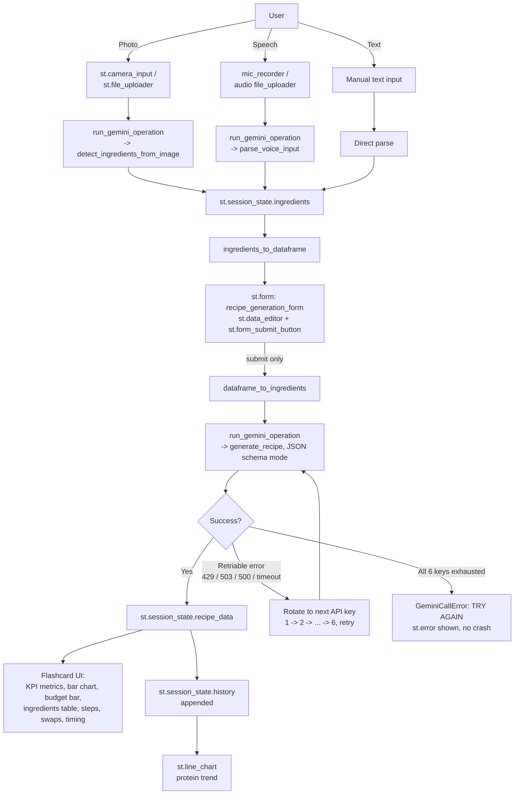

# System Architecture & Technical Design

## 1. Overview
Smart Kitchen Assistant combines three problem statements from the official
30-project directory: **#11 (Hyper-Local Macro Engine)** for the
protein/budget-target logic, **#14 (The Fridge-to-Feast Generator)** for the
camera-based ingredient detection and recipe generation, and **#8
(Voice-Notes to Flashcards)** as the inspiration for the structured
flashcard output format. It takes a user's available ingredients (via
camera, uploaded photo, voice, or uploaded audio) plus a protein/budget
target, and returns a tailored recipe generated by Gemini — rendered as a
set of professional flashcards. Every Gemini call is routed through a
6-key rotating fallback so a single rate-limited or overloaded key never
breaks the user experience.

## 2. Data Flow Diagram

## 3. Module Responsibilities

| Section (in `app.py`) | Responsibility |
|---|---|
| API key loading (`_load_env_file`, `configure_gemini`) | Reads `GEMINI_API_KEY_1..6` from `.env` or `st.secrets`, builds the key pool used for fallback |
| `run_gemini_operation` | The fallback engine — wraps every Gemini call, catches retriable errors, rotates keys, retries, raises `GeminiCallError` only after all keys are exhausted |
| `detect_ingredients_from_image` / `parse_voice_input` / `generate_recipe` | The three Gemini call types (vision, audio, text), each built on `run_gemini_operation` |
| `ingredients_to_dataframe` / `dataframe_to_ingredients` / `macros_to_dataframe` / `history_to_dataframe` | Pandas data pipeline — all ingredient/macro/history data passes through DataFrames with defensive checks |
| `render_recipe_flashcards` / `render_budget_progress` / `render_history_trend` | Presentation layer — renders the recipe as flashcards, charts, and progress bars |
| Main app body | Session state init, sidebar target form, input tabs, ingredient confirmation form, output rendering |

## 4. API Integration Strategy
- **SDK:** `google-genai` (current, actively-maintained Gemini SDK).
- **Model:** `gemini-3.5-flash` — native multimodal, accepts image, audio,
  and text in the same client.
- **System instruction:** Set per call via `GenerateContentConfig.system_instruction`,
  keeping the ChefCoach persona and constraints consistent across all three
  call types.
- **Dynamic context injection:** ingredients, protein target, budget, and
  meal type are injected into the generation prompt via f-strings at call
  time.
- **Structured output:** all three calls use native `response_mime_type="application/json"`
  with an explicit `response_schema` — Gemini enforces the shape server-side.

### Request/Response Schemas

| Call | Request | Response shape |
|---|---|---|
| `detect_ingredients_from_image` | `[prompt: str, image bytes]` | `string[]` (lowercase ingredient names) |
| `parse_voice_input` | `[prompt: str, audio bytes]` | `{ ingredients: string[], protein_target_g: number \| null }` |
| `generate_recipe` | `prompt: str` (f-string with live ingredients/target/budget) | `{ recipe_name, ingredients_used[], missing_or_optional_swaps[], steps[], macros{protein_g, carbs_g, fat_g, calories}, estimated_cost_inr, timing_and_digestion{best_time, why_it_works, pro_tip} }` |

## 5. Multi-Key Fallback System (Resilience Layer)

This is the part of the architecture that goes beyond the minimum rubric ask
and is worth explaining clearly at review.

**Problem:** a single Gemini API key has a rate limit. During a live demo
with rapid clicking, or simply from Gemini's own infrastructure being under
load, a request can fail with either:
- `429 RESOURCE_EXHAUSTED` — the key's own quota is used up
- `503 UNAVAILABLE` — Gemini's servers are overloaded, unrelated to the key

**Design:** `run_gemini_operation(api_call_fn)` takes any Gemini call as a
function argument, then:
1. Loads all configured keys (`GEMINI_API_KEY_1` through `_6`) into an
   ordered pool
2. Tries the current active key (tracked in `st.session_state.active_key_index`,
   so the app doesn't restart from key 1 on every call)
3. On a retriable error (`429`, `503`, `500`, `502`, `timeout`, `deadline`,
   `quota`, `unavailable`, etc.), rotates to the next key in the pool,
   shows a `st.toast` reading **"TRY AGAIN"**, waits 1 second (transient
   503s often clear quickly), and retries
4. Continues round-robin through all 6 keys before giving up
5. Only after all 6 keys fail does it raise `GeminiCallError`, which the UI
   layer catches and displays as a persistent `st.error` — never an
   unhandled crash

This means the three separate AI call types (vision, audio, text) all share
one resilience mechanism instead of each reimplementing retry logic.

## 6. Exception Handling
Every `run_gemini_operation` call is wrapped in `try/except` at the
`app.py` call sites (photo scan, photo upload, voice recording, voice
upload, recipe generation) and shows `st.error(...)` on final failure — no
unhandled exception reaches the terminal or crashes the running app.
`data_pipeline` functions apply the same defensive pattern to every
DataFrame transform.

## 7. State Management
`st.session_state` holds: `ingredients`, `protein_target`, `budget`,
`meal_type`, `recipe_data`, `history`, `api_configured`, and
`active_key_index` (which Gemini key is currently in rotation).

## 8. Deployment
- **Live:** https://capstoneprojecthaid3r.streamlit.app/
- Target: Streamlit Community Cloud
- Secrets: Gemini key(s) stored in Streamlit Cloud's secrets manager, never
  hardcoded or committed
- `requirements.txt`: `streamlit>=1.40.0` (required for `st.audio_input`),
  `google-genai==1.19.0`, `pandas==2.0.0`, `python-dotenv==1.1.1` — no
  OS-level dependencies

  **Fixed bug:** an earlier version of this file pinned `streamlit==1.33.0`,
  which predates `st.audio_input` (GA'd in 1.40). Since Streamlit executes
  the full script top-to-bottom every rerun regardless of which tab is
  visually active, calling a non-existent attribute in the voice tab would
  throw `AttributeError` and halt script execution before the ingredient
  confirmation, generate button, and output sections ever rendered. This is
  the kind of failure that's invisible in local testing if you happen to
  have a newer Streamlit installed globally, but breaks immediately on a
  clean cloud deploy that installs exactly what `requirements.txt` specifies.
